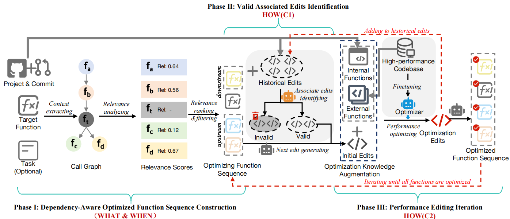

# Peace: Towards Efficient Project-Level Performance Optimization via Hybrid Code Editing
Source code for Peace


### Description

This repository contains the project-level PEACExec, training and evaluation code for the paper "*Peace: Towards Efficient Project-Level Performance Optimization via Hybrid Code Editing*".




​									  **Fig.1** The overall framework of PEACE

**Fig. 1** shows the overall framework of PEACE, which aims to opti-mize a target function and ensure the correctness and integrity of the overall project at the same time. To achieve this goal, PEACE first analyzes code contexts to construct an optimizing function se-quence to edit, and then identify valid associated edits. After that, it leverages valid associate edits along with both internal and externalhigh-performance functions to iteratively optimize the functionsin the optimizing function sequence. Specifically, PEACE containsthree main phases: Dependency-Aware Optimizing Function Se-quence Construction (Phase I),Valid Associated Edits Identification(Phase II), and Performance Editing Iteration (Phase III).


## Dependency

Python == 3.10.14

C++17

GCC 9.4.0

Linux

Run the following command in the root directory of this repo:

```shell
pip install -r requirements.txt
```


 

## Content

\denpendAnalysisTool

```
denpendAnalysisTool is the dependency analysis tool, the model parameter file is given
```

\peace

```
PEACE is a framework for repo level code performance optimization that requires manual API configuration while training models to complete the preparation of the framework
```

\docker

```
PEACExec is a repo level code performance benchmark, all running environments are configured in docker
```

\util

```
some additional information will be dynamically provided based on the requirements, such as the keywords used during the coarse-grained screening of commits.
```


#### More detail and usage can be see in the respective README.md on each file. 


